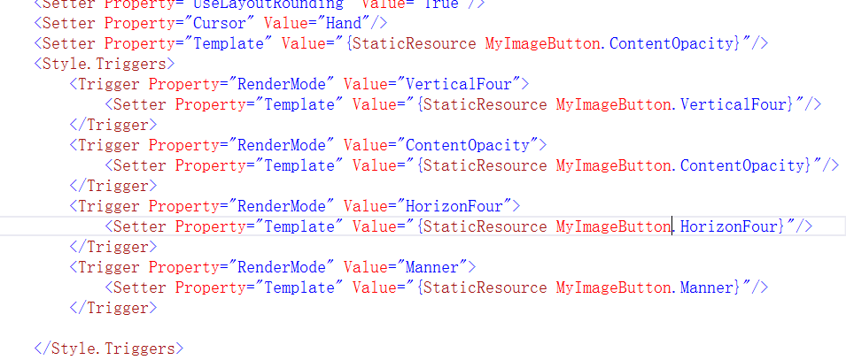
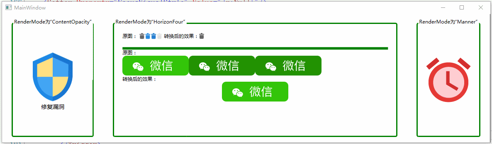

# 向大家分享在项目中编写的比较实用的控件：MyImageButton
### lib文件夹中放的是控件的源码dll，该dll包含大量本人在这几年项目中的控件，现在逐步编写到github上，[github地址](https://github.com/y19890902q/MyWPFUI.git)
* 依赖属性RenderMode：HorizonFour（横向4图方式）、VerticalFour（纵向4图方式）、ContentOpacity（内容模式）、Manner（自定义模式）
* HorizonFour（横向4图方式）和VerticalFour（纵向4图方式）均是通过一张图片来排版，原理是使用ImageBrush的Viewbox属性来切割比列，每次切割25%
* 再Manner模式下：属性ICO为正常显示图片，HoverIcon为鼠标滑过显示图片、PressedIcon为鼠标按压时的图片，DisabledIcon为按钮不可用时的图片

# 演示

